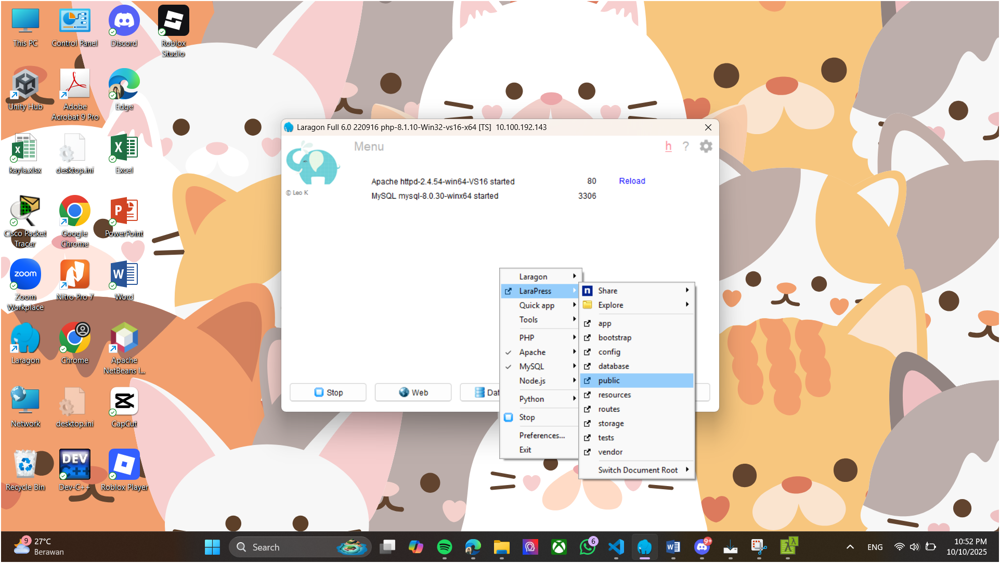

# Praktikum 3 : LaraPress

## Langkah-Langkah
1. Cek versi composer

2. Kalau belum ada composer, download dan install terlebih dahulu

3. Masuk ke folder Pertemuan_3 dan jalankan perintah 'composer create-project laravel/laravel LaraPress'

4. Ubah isi dari file resources/views/welcome.blade.php

5. Jalankan php artisan serve pada terminal atau start pada laragon

Tampilan Page Welcome

6. Buat file about.blade.php pada folder resource/views

Edit routes/web.php untuk membuat page baru

Tampilan Page About

7. Buat file kontak.blade.php pada folder resource/views

Tampilan Page Kontak
