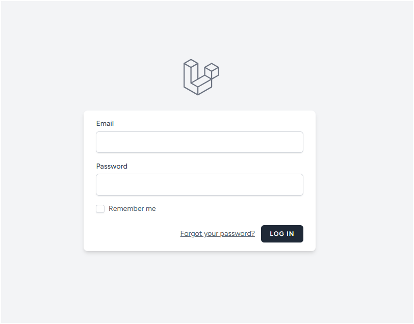

# Pastikan berada di folder yang sesuai
# cd LaraPress
# Jalankan perintah 'composer require laravel/breeze --dev'
# composer require laravel/breeze --dev
# Jalankan perintah untuk menginstall breeze
# php artisan breeze:install
# Ketik 'blade' untuk Blade with Alpine
# Ketik 'No' untuk Dark Mode Support
# Ketik '0' untuk Pest
# Install dependencies frontend menggunakan perintah 'npm install' lalu 'npm run dev'
# npm install npm run dev
# Jalankan perintah 'php artisan migrate' untuk menambahkan kolom remember_token ke tabel users dan membuat tabel password_reset_tokens
# php artisan migrate
# Tampilan Page Login ketika sudah berhasil
